# Architektura Autentykacji Platformy FairPlay

## Analiza przepływów autentykacji

1. **Przepływy**: rejestracja użytkownika, logowanie, wylogowanie, ochrona route'ów i żądania przez middleware, inicjalizacja hooka `useAuth`, automatyczne odświeżanie sesji, obsługa statusu pending.
2. **Aktorzy i interakcje**: Przeglądarka wywołuje API, middleware filtruje żądania, Astro API rozmawia ze Supabase Auth, baza `public.users` przechowuje profil.
3. **Weryfikacja i refresh**: Middleware oraz API sprawdzają sesję i status konta; Supabase SDK odnawia tokeny `access`/`refresh` przy zdarzeniach `SIGNED_IN`.
4. **Kroki**: Formularze walidują dane, Supabase `signUp` tworzy konto ze statusem pending, logowanie `signInWithPassword` potwierdza rolę i status, brak sesji powoduje redirect, wylogowanie czyści stan lokalny oraz Supabase Auth.

## Diagram sekwencyjny

```mermaid
sequenceDiagram
    autonumber

    participant Browser
    participant Middleware
    participant API
    participant Supabase
    participant Database

    %% Rejestracja nowego użytkownika
    rect rgb(240, 248, 255)
        note over Browser,Database: Rejestracja nowego użytkownika (US-001)
        Browser->>Browser: Wypełnij formularz rejestracji
        Browser->>API: POST /api/auth/register
        activate API
        API->>API: Walidacja danych (Zod schema)
        API->>Supabase: signUp(email, password, metadata)
        Supabase-->>API: Utwórz użytkownika w auth.users
        API->>Database: INSERT users (auth_id, status=pending)
        API-->>Browser: 201 Created (user, message)
        deactivate API
        Browser->>Browser: Pokaż komunikat o statusie pending
    end

    %% Logowanie użytkownika
    rect rgb(255, 248, 220)
        note over Browser,Database: Logowanie użytkownika (US-002)
        Browser->>Browser: Wypełnij formularz logowania
        Browser->>API: POST /api/auth/login
        activate API
        API->>API: Walidacja danych logowania
        API->>Supabase: signInWithPassword(email, password)
        alt Uwierzytelnienie poprawne
            Supabase-->>API: Session data + user
            API->>Database: SELECT users WHERE auth_id = user.id
            Database-->>API: User profile (status, role)
            alt Status = approved
                API-->>Browser: 200 OK (session, userDTO)
                Browser->>Browser: Zapisz sesję w Supabase Client
                Browser->>Browser: Przekieruj do dashboardu
            else Status = pending
                API-->>Browser: 403 Forbidden (PENDING_APPROVAL)
                Browser->>Browser: Przekieruj do pending-approval
            end
        else Uwierzytelnienie niepoprawne
            Supabase-->>API: Auth error
            API-->>Browser: 401 Unauthorized (INVALID_CREDENTIALS)
            Browser->>Browser: Wyświetl błąd formularza
        end
        deactivate API
    end

    %% Dostęp do chronionych stron
    rect rgb(220, 255, 220)
        note over Browser,Database: Dostęp do chronionych widoków
        Browser->>Middleware: Żądanie zasobu chronionego
        activate Middleware
        Middleware->>Middleware: requiresUserContext() = true
        Middleware->>Middleware: Sprawdź isDashboardAuthDisabled
        alt Tryb deweloperski
            Middleware->>Middleware: ensureDevDashboardData()
            Middleware->>Browser: Kontynuuj jako dev user
        else Tryb produkcyjny
            Middleware->>Supabase: getSession()
            alt Sesja istnieje
                Supabase-->>Middleware: Session + user
                Middleware->>Database: SELECT users WHERE id = user.id
                Database-->>Middleware: User profile
                alt Status = approved
                    Middleware->>Middleware: Ustaw locals.user i actor
                    Middleware->>Browser: Zezwól na dostęp
                else Status = pending
                    Middleware-->>Browser: Redirect /pending-approval
                end
            else Brak sesji
                Middleware-->>Browser: Redirect /login
            end
        end
        deactivate Middleware
    end

    %% useAuth hook - inicjalizacja
    rect rgb(255, 220, 220)
        note over Browser,Database: Inicjalizacja hooka useAuth
        Browser->>Browser: Start useAuth()
        Browser->>Browser: Sprawdź isDashboardAuthDisabled
        alt Tryb deweloperski
            Browser->>API: GET /api/auth/session
            API-->>Browser: UserDTO dev
            Browser->>Browser: setAuthenticated + setUser
        else Tryb produkcyjny
            Browser->>Supabase: getSession()
            Supabase-->>Browser: Session data
            alt Sesja istnieje
                Browser->>Supabase: SELECT users WHERE id = user.id
                Supabase-->>Browser: User profile
                Browser->>Browser: setAuthenticated + setUser
                Browser->>Supabase: onAuthStateChange()
            else Brak sesji
                Browser->>Browser: setAuthenticated(false)
            end
        end
        Browser->>Browser: setIsLoading(false)
    end

    %% Odświeżanie sesji
    rect rgb(248, 248, 255)
        note over Browser,Supabase: Automatyczne odświeżanie sesji
        Supabase->>Supabase: Monitoruj wygaśnięcie tokenu
        Supabase->>Supabase: refreshSession() przez SDK
        Supabase-->>Supabase: Nowe access i refresh tokeny
        Browser->>Browser: onAuthStateChange('SIGNED_IN')
        Browser->>Browser: Aktualizuj stan useAuth
    end

    %% Wylogowanie
    rect rgb(255, 240, 245)
        note over Browser,Supabase: Wylogowanie użytkownika (US-016)
        Browser->>Browser: Kliknięcie przycisku Wyloguj
        Browser->>Browser: useAuth.logout()
        Browser->>Browser: Sprawdź isDashboardAuthDisabled
        alt Tryb deweloperski
            Browser->>Browser: setAuthenticated(false) + clearUser
        else Tryb produkcyjny
            Browser->>Supabase: signOut()
            Supabase-->>Browser: Potwierdzenie wylogowania
        end
        Browser->>Browser: Czyść lokalny stan i redirect
    end

    %% Obsługa statusu pending
    rect rgb(255, 255, 224)
        note over Browser,Database: Konto w statusie pending
        Browser->>Browser: Próba wejścia na dashboard
        Middleware->>Middleware: Ponowna weryfikacja statusu
        alt Nadal pending
            Middleware-->>Browser: Redirect /pending-approval
            Browser->>Browser: Pokaż komunikat oczekiwania
            Browser->>Browser: Umożliw wylogowanie
        end
        note over Browser: Admin zatwierdza konto aby dopuścić logowanie
    end
```

## Opis przepływów autentykacji

### 1. **Rejestracja nowego użytkownika (US-001)**

- Użytkownik wypełnia formularz rejestracji w przeglądarce.
- Frontend waliduje dane lokalnie (React + Zod).
- Żądanie trafia do `/api/auth/register` i przechodzi walidację Zod.
- Supabase `signUp` tworzy konto ze statusem `pending` w `users`.
- Użytkownik dostaje komunikat o oczekiwaniu na zatwierdzenie.

### 2. **Logowanie użytkownika (US-002)**

- Formularz logowania waliduje dane lokalnie.
- Backend sprawdza credentiale przez Supabase Auth.
- Profil z `public.users` determinuje status konta.
- `approved` → przekierowanie do dashboardu; `pending` → redirect do `pending-approval`.

### 3. **Middleware - ochrona stron**

- Middleware wymusza sesję dla wszystkich zasobów poza whitelist.
- Tryb dev korzysta z `ensureDevDashboardData`.
- Produkcja weryfikuje sesję oraz status w bazie.
- Ustawia `locals.user` i `locals.actor` dla dalszej obsługi.

### 4. **Hook useAuth - zarządzanie stanem**

- Hook inicjalizuje się i sprawdza, czy auth jest wyłączone.
- W produkcji pobiera sesję Supabase i profil użytkownika.
- Subskrybuje `onAuthStateChange`, aktualizując stan klienta.

### 5. **Wylogowanie (US-016)**

- `logout()` wywołuje Supabase `signOut()` (prod) lub czyści stan (dev).
- Sesja i dane użytkownika są usuwane, następuje redirect do `/login`.

### 6. **Obsługa statusów użytkowników**

- `pending`: użytkownik widzi ekran oczekiwania.
- `approved`: pełen dostęp zgodnie z rolą.
- `deleted_at`: middleware traktuje konto jako nieaktywne.

## Kluczowe komponenty systemu

### Frontend (React)

- `LoginForm.tsx` i `useLoginForm.ts` do walidacji klienta.
- `useAuth.ts` zarządza sesją i subskrypcją Supabase.
- `RegisterForm.tsx` realizuje rejestrację użytkownika.

### Backend (Astro)

- `middleware/index.ts` zabezpiecza SSR i API.
- `/api/auth/session.ts` obsługuje zapytania o bieżącą sesję.
- Zaplanowane endpointy `login`, `register`, `logout` spajają Supabase z frontendem.

### Baza danych (Supabase)

- `auth.users` przechowuje dane logowania.
- `public.users` mapuje status i role kont.
- `public.players` zawiera profile graczy niezależne od kont.

## Bezpieczeństwo

- Tokeny w HttpOnly cookies, flaga `SameSite=Strict`.
- Włączone RLS dla tabel domenowych.
- Supabase zapewnia rate limiting i automatyczny refresh tokenów.
- Soft delete (`deleted_at`) ukrywa dezaktywowane konta.

## Tryb deweloperski

- `PUBLIC_DISABLE_DASHBOARD_AUTH=true` omija weryfikację.
- `ensureDevDashboardData` generuje testowe konto.
- `/api/auth/session` zwraca dane dev, middleware przepuszcza ruch.
