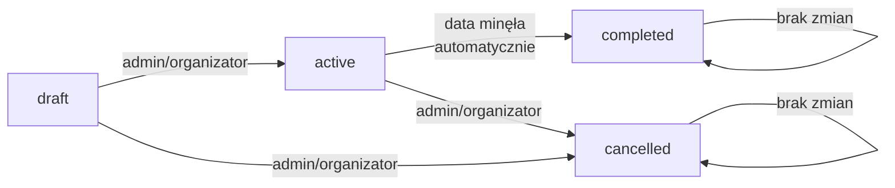

# Flow statusów wydarzeń - FairPlay Platform

## Przegląd

Dokumentacja opisuje cykl życia wydarzeń i możliwe zmiany statusów w platformie FairPlay.

## Statusy wydarzeń

### 1. `active` (domyślny)
- **Kiedy**: Nowo utworzone wydarzenie
- **Widoczność**: Wszyscy użytkownicy (admini, organizatorzy, zatwierdzeni gracze)
- **Zapisy**: ✅ Otwarte
- **Opis**: Wydarzenie jest aktywne i gotowe do zapisów

### 2. `completed`
- **Kiedy**: Automatycznie po minięciu daty wydarzenia (`event_datetime`)
- **Widoczność**: Admini i organizatorzy
- **Zapisy**: ❌ Zamknięte
- **Opis**: Wydarzenie już się odbyło
- **Uwaga**: Status ustawiany automatycznie podczas pobierania listy wydarzeń lub szczegółów

### 3. `cancelled`
- **Kiedy**: Ręcznie przez admina lub organizatora
- **Widoczność**: Admini i organizatorzy
- **Zapisy**: ❌ Zamknięte
- **Opis**: Wydarzenie zostało anulowane przed jego rozpoczęciem

### 4. `draft` (legacy)
- **Kiedy**: Nie używany w nowych wydarzeniach
- **Widoczność**: Admini i organizatorzy
- **Zapisy**: ❌ Zamknięte
- **Opis**: Status pozostawiony dla kompatybilności wstecznej

## Możliwe przejścia statusów



### Szczegóły przejść:

| Z statusu | Do statusu | Warunek | Sposób |
|-----------|------------|---------|---------|
| `active` | `completed` | Data wydarzenia minęła | **Automatycznie** przy `listEvents()` i `getEventById()` |
| `active` | `cancelled` | Admin/organizator decyduje | **Ręcznie** przez `updateEvent()` |
| `draft` | `active` | Admin/organizator publikuje | **Ręcznie** przez `updateEvent()` |
| `draft` | `cancelled` | Admin/organizator anuluje | **Ręcznie** przez `updateEvent()` |

### Niedozwolone przejścia:

- ❌ Z `completed` do jakiegokolwiek innego statusu
- ❌ Z `cancelled` do jakiegokolwiek innego statusu

## Uprawnienia

### Tworzenie wydarzeń
- ✅ Admin
- ✅ Organizator
- ❌ Gracz

**Domyślny status**: `active`

### Zmiana statusu
- ✅ Admin: może zmieniać status dowolnego wydarzenia
- ✅ Organizator: może zmieniać status tylko własnych wydarzeń
- ❌ Gracz: nie może zmieniać statusu

### Widoczność wydarzeń (RLS)
- **Admin**: widzi wszystkie statusy
- **Organizator**: widzi wszystkie statusy
- **Gracz**: widzi tylko `active`

## Automatyczne oznaczanie jako `completed`

### Mechanizm
Metoda `autoCompleteEvents()` w `EventService` automatycznie aktualizuje status wydarzeń:

```typescript
// Warunek SQL
WHERE status = 'active' 
  AND event_datetime < NOW() 
  AND deleted_at IS NULL
```

### Kiedy się uruchamia:
- ✅ Przed `listEvents()` - pobieranie listy wydarzeń
- ✅ Przed `getEventById()` - pobieranie szczegółów wydarzenia

### Dlaczego nie w tle:
- MVP nie wymaga scheduled jobs
- Prostota implementacji
- Wystarczające dla małej skali (<50 użytkowników)
- W przyszłości można dodać cronjob jeśli potrzeba

## Przykłady użycia

### 1. Tworzenie nowego wydarzenia
```typescript
// POST /api/events
// Body: { name, location, event_datetime, max_places, ... }

// Rezultat: Wydarzenie z status = 'active'
// Widoczne od razu dla graczy
```

### 2. Anulowanie wydarzenia
```typescript
// PATCH /api/events/:id
// Body: { status: 'cancelled' }

// Walidacja:
// - Tylko admin/organizator właściciel
// - Tylko jeśli aktualny status to 'active' lub 'draft'

// Rezultat: Wydarzenie ukryte dla graczy
```

### 3. Automatyczne completion
```typescript
// GET /api/events
// Przed zwróceniem listy:
// 1. autoCompleteEvents() oznacza przeszłe jako 'completed'
// 2. Zwraca listę (z uwzględnieniem filtrów RLS)

// Gracze nie zobaczą 'completed'
// Admini/organizatorzy zobaczą
```

## Komunikaty błędów dla zapisów

Gdy gracz próbuje zapisać się na wydarzenie:

| Status | Komunikat |
|--------|-----------|
| `active` | ✅ Zapis udany |
| `cancelled` | ❌ "Wydarzenie zostało anulowane - zapisy są niemożliwe" |
| `completed` | ❌ "Wydarzenie już się odbyło - zapisy są zamknięte" |
| `draft` | ❌ "Wydarzenie jest w trybie roboczym - zapisy nie są jeszcze dostępne" |

## Historia zmian

### 2025-11-12 - Główna implementacja
- Zmiana domyślnego statusu z `draft` na `active`
- Dodanie statusu `cancelled`
- Implementacja automatycznego `completed`
- Aktualizacja walidacji i komunikatów błędów
- Migracja: `20251112210000_add_cancelled_status.sql`

## Zgodność z PRD

Implementacja zgodna z wymaganiami:
- ✅ **US-005**: "Wydarzenie widoczne w feedzie po stworzeniu" - status `active` od razu
- ✅ **US-007**: One-click zapis - dostępny dla `active` wydarzeń
- ✅ **US-013**: Admin może edytować/usuwać wydarzenia - może też anulować
- ✅ Automatyczne oznaczanie jako zakończone po minięciu daty

